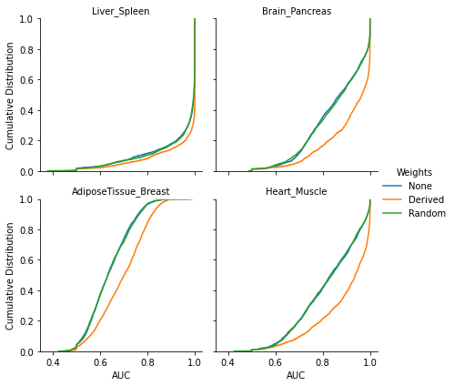

# OntoVAE with reconstruction loss weights

The object of this project was to allow the inclusion of input node weightings for the reconstruction loss of OntoVAE. We have implemented the inclusion [in the vae_model.py module in this forked github repository](https://github.com/david-hirst/onto-vae/blob/main/onto_vae/vae_model.py). We have inserted an argument, `rec_loss_wts`, into the function called to train OntoVAE 
```
def train_model(...., rec_loss_wts=None):
```
If the user wants to weight the relative contributions of input nodes to the reconstruction loss, they enter a path to a csv file containing the weights, for example
```
ontovae_model.train_model(...., rec_loss_wts = os.path.join(os.getcwd(),'gene_weights.csv'))
```
The first column of the csv should contain gene symbols consistent with those used in the loaded ontology object. The second column should contain a weight for each gene. The function expects the csv file to contain column headings, although the headings themselves are ignored. If the user ignores this argument then the training is performed without any node weighting.

## Background

OntoVAE is a variational autoencoder (VAE) that allows for the incorporation of any biological ontology that is a directed acyclic graph (DAG). 

A VAE consists of two neural networks, an encoder and a decoder. The input for the encoder is $\boldsymbol{x}$, which is a $D$-dimensional vector whose elements are the input nodes. The encoder derives $q_{\phi}(\boldsymbol{z}|\boldsymbol{x})$, where $\boldsymbol{z}$ is a vector whose $K$ elements are the nodes in the latent layer. The decoder takes the elements of $\boldsymbol{z}$ as input nodes and derives $\hat{\boldsymbol{x}}$, which is a reconstruction of $\boldsymbol{x}$. 

In OntoVAE, the structure of the decoder is based on a user provided DAG. Each node in the decoder, including those in the latent layer, represents a vertex in the DAG, and connections between decoder nodes are only possible if consistent with the edges between vertices in the DAG. Constraining the decoder in this way allows for interpretability of the decoder node values generated for a given $\boldsymbol{x}$.

We hypothesised that the meaningfulness of the latent values generated by OntoVAE could be improved by weighting the contribution of each input node to the OntoVAE loss function. 

## Weighted reconstruction loss

For a dataset $\boldsymbol{X}$, the contribution of the $i^{th}$ sample to the OntoVAE loss function is 
$$L(\boldsymbol{x}^{(i)}, \theta, \phi) = \lambda \times D_{KL}(q_{\phi}(\boldsymbol{z}|\boldsymbol{x}^{(i)})||p(\boldsymbol{z})) + \sum_{d=1}^D (x^{(i)}_d - \hat{x}^{(i)}_d)^2$$

Underlying this is the assumption of independent gaussian input nodes, each characterised by $p_{\theta}(x^{(i)}_d|\boldsymbol{z}^{(i)}) = N(\hat{x}^{(i)}_d,\sigma^2)$.

If input node weightings are specified when training OntoVAE, the loss function incorporates a $D$-dimensional vector of weights, $\boldsymbol{w}$ : 

$$L_w(\boldsymbol{x}^{(i)}, \theta, \phi) = \lambda \times D_{KL}(q_{\phi}(\boldsymbol{z}|\boldsymbol{x}^{(i)})||p(\boldsymbol{z})) + \sum_{d=1}^D w_d(x^{(i)}_d - \hat{x}^{(i)}_d)^2$$

This is equivalent to assuming $p_{\theta}(x^{(i)}_d|\boldsymbol{z}) = N(\hat{x}^{(i)}_d,\nu_d\sigma^2)$, where $w_d = 1/\nu_d$

In our implementation, the user supplies a vector of raw weights $\boldsymbol{r}$, which we normalize to give 
$$w_d =  \frac{r_d \times D}{\sum r_d}$$

## Evaluation

We evaluated our implementation by finetuning an exisitng OntoVAE model. The exisitng model used a trimmed version of the Gene Ontology (GO), and had been trained on GTEx expression data. In this conext, each input node is a gene and the decoder terms represent terms from the GO.

We created four subsets of the full GTEx expression dataset for calculating weights and finetuning the model. Each subset contained RNA-seq values for samples from one of two tissues. The four tissues type pairs were:

- liver and spleen
- brain and pancreas
- adipose tissue and breast
- heart and muscle

For each tissue pair, we performed a differential expression analysis with DESeq2. We used the absolute vlaue of the moderated log2 fold change between the two tissue types as the raw weight for each gene.

For each subset, we trained the exisitng OntoVAE model for a further 100 epochs, using only the expression subset as input data. We carried out finetuning without weights, with derived weights, and with a vector of randomly generated weights. Each finetuning run was carried out independently of the others, meaning only the initial trained model was used as a starting point.

We evaluated each finetuned model by generating decoder node values for each sample. For each decoder node, we trained a naive Bayes classifier with 10-fold cross validation and computed the median area under the curve (AUC). The median AUC indicates how useful the node was for the classification of samples with respect to the two tissue types. The empirical cumulative distributions and boxplots of AUC scores are shown below for each subset and weighting method. We observe that for liver and spleen, the decoder nodes already classify the samples well and there is little gain from using the derived weights. However, for the other tissue pairs there was a noticiable improvement in the overall distriubtion of AUC scores after using the derived weights in the finetuning.

<p align="center">
 
</p>

We looked at the GO terms associated with the decoder nodes to determine which terms had the largest improvement in AUC (from using derived nodes versus unweighted finetuning). The table below shows the five terms with the biggest improvement in AUC, for the three tissue pairs for which we had observed a noticable improvement in the overall distribution.
  
|Tissue pair |Term |
|------------|-----|
|Brain, Pancreas|positive regulation of reproductive process|
| |mesonephric epithelium development|
| |kidney epithelium development|
| |cell cycle G2/M phase transition|
| |response to reactive oxygen species|
| | |
|Heart, Muscle|skeletal muscle tissue development|
| |muscle tissue development|
| |striated muscle tissue development|
| |cellular response to acid chemical|
| |positive regulation of leukocyte mediated immunity|
| | |
|Adipose Tissue, Breast|Wnt signaling pathway, calcium modulating pathway|
| |Wnt signaling pathway|
| |maintenance of cell number|
| |cell surface receptor signaling pathway involved in cell-cell signaling|
| |canonical Wnt signaling pathway|

## Discussion

We observed that weighting the contibutions of nodes to the reconstruction loss resulted in latent values that better differentiated between sample groups. This initial, proof-of-concpet, analysis suggests it is worthwhile further pursuing the idea of input node weighting. A potential limitation of the study is that we used the smae data for weighting the nodes as for finetuning the model. Therefore a potential next step would be to incorporate node weightings that are based on prior knowledge that is independent of the input dataset.

## Code used in analysis

[The code used for carrying out the finetuning](https://github.com/david-hirst/onto-vae/blob/main/weighted_loss_analysis/GO_pretrained_finetune.py)

[The code used for evaluating the finetuned models](https://github.com/david-hirst/onto-vae/blob/main/weighted_loss_analysis/OntoVAE_Wghtng_Assess.py)

[The notebook used for creating plots](https://github.com/david-hirst/onto-vae/blob/main/weighted_loss_analysis/OntoVAE_Wghtng_Summarise.ipynb)

