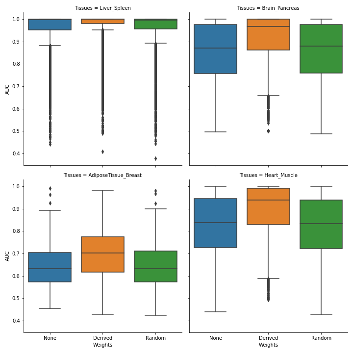

# Onto-VAE with reconstruction loss weights

The object of this project was to allow the optional inclusion of node weightings for the reconstruction loss of Onto-VAE. We have implemented this in the [vae_model.py module](https://github.com/david-hirst/onto-vae/blob/main/onto_vae/vae_model.py) in this forked repository. 

## Results

The empirical cumulative distribution of AUC scores

Boxplots of the AUC values

